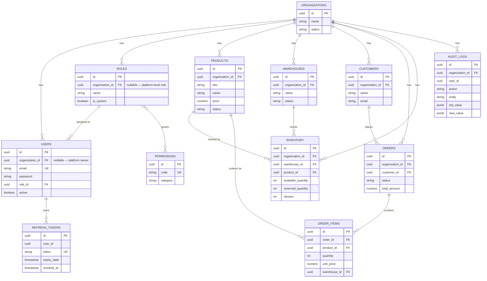

# Database

PostgreSQL, one shared schema for every tenant, managed through Flyway migrations under `backend/src/main/resources/db/migration`. There's no `ddl-auto: update` here — the schema is owned by the migration files, and Hibernate is only ever allowed to validate that the entities match what's already there. If you need to change the schema, you write a new migration; you don't let Hibernate improvise one at startup.

## ER diagram

There are two more tables not shown above because they don't participate in the domain model the way the rest do: `notifications` (organization-wide event feed backing the SSE stream) and `outbox_events` (the transactional outbox behind the RabbitMQ publisher — see `docs/DESIGN_PATTERNS.md` if you want the reasoning behind it).

## Constraints

**SKU uniqueness is per-organization, not global.** `UNIQUE (organization_id, sku)` on `products` — two different tenants can both have a product called `SKU-001`.

**Same idea for inventory rows.** `UNIQUE (organization_id, warehouse_id, product_id)` — one row per product per warehouse per tenant. Everything about stock levels reads and writes through this one row.

**And for customer email**, `UNIQUE (organization_id, email) WHERE email IS NOT NULL`. It's a partial index rather than a plain unique constraint because customers aren't required to have an email at all (only the name is mandatory), and Postgres treats every `NULL` in a unique index as distinct from every other `NULL`, so that would've worked anyway — the `WHERE` clause just makes the intent explicit.

**Inventory can't go negative, full stop.** `CHECK (available_quantity >= 0)` and `CHECK (reserved_quantity >= 0)` sit underneath the application-level guards described in `ARCHITECTURE.md`. If a future bug in the service layer ever tried to write a negative value, the database itself refuses the write rather than silently accepting bad data.

**Roles are unique per organization by name**, with one specific carve-out: `roles.organization_id` can be `NULL` for exactly one row, the platform owner role, and Postgres's default handling of `NULL` in a unique index (each `NULL` is its own distinct value) means that single row doesn't need special-casing.

## Indexes

Every tenant table has a plain index on `organization_id`, since that's the first thing almost every query filters on. On top of that:

- `orders(organization_id, status)`, `orders(organization_id, customer_id)`, `orders(organization_id, created_at)` — for the orders list screen's filters and default sort
- `inventory(organization_id, warehouse_id)` and `inventory(organization_id, product_id)` — for "show me everything in this warehouse" / "show me this product across all warehouses"
- `audit_logs(organization_id, entity)` and `audit_logs(organization_id, created_at)` — same reasoning for the audit log screen
- `notifications(organization_id, user_id)` and `notifications(organization_id, read)` — for pulling a recipient's unread backlog when an SSE connection opens

## How stock quantities actually change

An inventory row has two counters:

- `available_quantity` — stock that's free to be reserved right now
- `reserved_quantity` — stock that's been claimed by an order but hasn't shipped yet

| Event | available | reserved |
|---|---|---|
| Stock added (manual adjustment, positive) | up | — |
| Stock removed (manual adjustment, negative) | down | — |
| Order created | down | up |
| Order cancelled | up (restored) | down |
| Order completed | — | down (consumed, not returned) |
| Transfer between warehouses | down at source, up at destination | — |

The distinction between "cancelled" and "completed" matters: cancelling gives the stock back because nothing actually left the building, while completing an order means it shipped, so that reservation is gone for good rather than bouncing back into `available_quantity`.

Every one of these is a single atomic, conditional `UPDATE` — never a read-then-write — which is the whole reason concurrent requests against the same row can't oversell it. `ARCHITECTURE.md` walks through why that matters and what happens without it.

